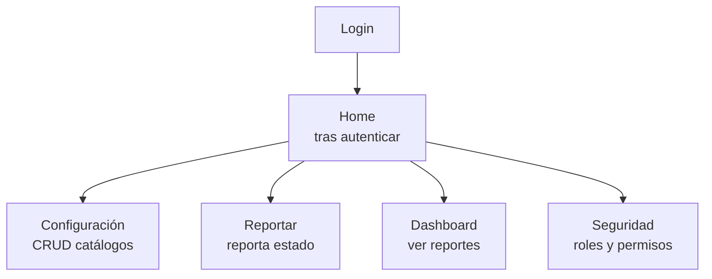
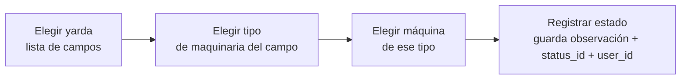
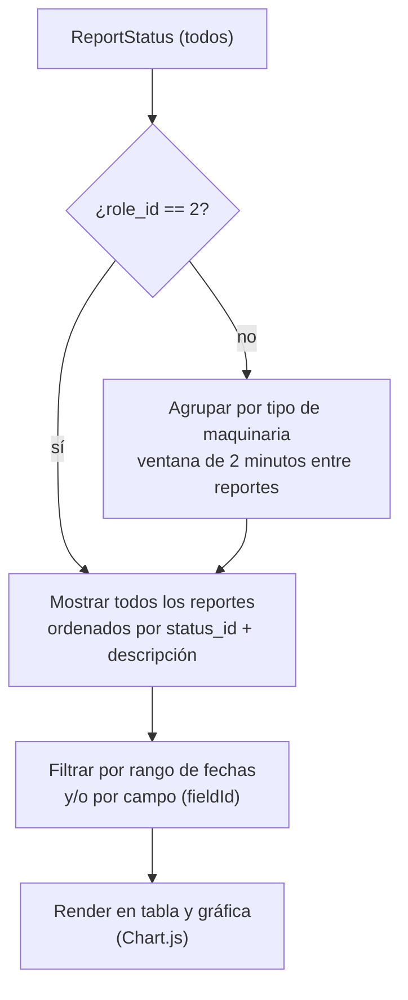
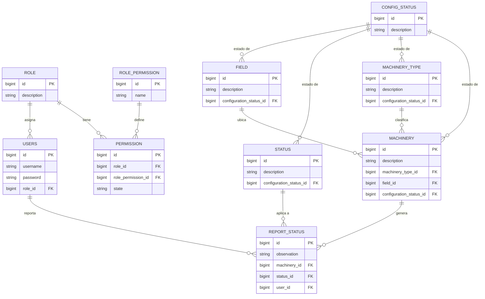

# Análisis Técnico — TFPB-Maquinaria

**Repositorio analizado:** `Ingejp/TFPB-Maquinaria`
**Fecha de análisis:** 2026-07-22
**Propósito de este documento:** Servir como input para Claude Code, para complementar el sistema actual y/o reconstruirlo desde cero con tecnologías actualizadas, preservando funcionalidad y corrigiendo los hallazgos de seguridad y deuda técnica documentados aquí.

---

## 0. Resumen ejecutivo

Sistema web de **control de maquinaria agrícola/industrial por yardas (campos)**, que permite:
- Catalogar maquinaria, tipos de maquinaria y campos ("yardas")
- Reportar el estado operativo de cada máquina (bitácora de estados)
- Visualizar dashboards con reportes filtrados por tipo de maquinaria, campo y rango de fechas
- Administrar un sistema de roles y permisos granular por URL/acción

**Stack actual:** Laravel 8 (PHP ^7.3) + Vue 2 + Bootstrap 5 + MySQL/MariaDB (vía Eloquent), autenticación por sesión de Laravel, sin API REST real (solo rutas web protegidas con sesión).

**Estado general:** Funcional pero con **stack obsoleto** (PHP 7.3 y Laravel 8 están fuera de soporte de seguridad; Vue 2 llegó a EOL en dic-2023), **sin tests reales**, **RBAC hecho a mano** (no usa Spatie ni Gates/Policies nativos de Laravel) y **varios hallazgos de seguridad** que se detallan en la sección 6.

> **Decisión de proyecto: reconstrucción completa, no migración incremental.** Dado el tamaño acotado del sistema (9 entidades, en su mayoría CRUD simple + un flujo de reporte de 3 pasos + un dashboard), la ausencia de tests que respalden una migración incremental, y que buena parte de la lógica de negocio (RBAC custom, agregaciones del Dashboard, catálogo `config_status`) ya está identificada como código a reescribir de todas formas, se opta por reconstruir desde cero en vez de migrar el código existente paso a paso.
>
> - **Backend objetivo: Laravel 13** (requiere PHP 8.3+; release del 17-mar-2026, con bug fixes hasta Q3 2027 y seguridad hasta Q1 2028 — buen margen de soporte).
> - **Frontend objetivo: Vue 3.**
> - **Patrón de integración: Blade + islas de Vue 3** (mismo patrón que el sistema actual, actualizado — no Inertia, no API+SPA separada). Decisión cerrada.
> - **UI/UX: rediseño completo, no se preserva la apariencia actual.** Se descarta portar el look de Bootstrap 5 tal cual — la reconstrucción es la oportunidad de modernizar la identidad visual completa. Ver detalle en sección 1.4.
> - **Base de datos: se reutiliza la instancia existente en AWS RDS, sin migración de datos ni reescritura completa de migraciones.** La app nueva apunta directamente a la misma base. Solo se crean migraciones puntuales y aisladas para los cambios estrictamente necesarios (ver sección 4.5) — todo lo demás del esquema se deja como está.

> **Alcance definido para la reconstrucción (decisiones ya tomadas, no abiertas a evaluación):**
> - **No se agrega CI/CD.** El despliegue seguirá siendo manual/tradicional.
> - **No se agrega Docker/IaC.** Se mantiene el modelo de despliegue actual (servidor tradicional).
> - **No hay ninguna funcionalidad de recuperación de contraseña dentro del sistema** (ni autoservicio ni administrativa). Ante un olvido, el usuario contacta al administrador fuera de la aplicación. El flujo scaffoldeado de "olvidé mi contraseña" (`ForgotPasswordController`/`ResetPasswordController`) y su link en el login deben **eliminarse** por completo, sin reemplazo.

---

## 1. Arquitectura y stack tecnológico

### 1.1 Backend
| Componente | Versión / detalle |
|---|---|
| Lenguaje | PHP `^7.3` (EOL desde nov-2021) |
| Framework | Laravel `^8.0` (EOL, sin soporte de seguridad desde ene-2023) |
| Paquetes clave | `fruitcake/laravel-cors` `^2.0`, `laravel/ui` `^3.4`, `laravel/tinker`, `guzzlehttp/guzzle` `^7.0.1`, `fideloper/proxy` `^4.2` |
| Testing | `phpunit/phpunit` `^9.3`, `mockery`, `facade/ignition` (debug) |
| ORM | Eloquent (patrón Active Record) |
| Autenticación | Laravel session-based auth (`Auth::routes()`), scaffolding de `laravel/ui` |
| **Objetivo de reconstrucción** | **PHP 8.3+, Laravel 13** (ver decisión en Resumen ejecutivo) |

### 1.2 Frontend
| Componente | Versión / detalle |
|---|---|
| Framework JS | **Vue 2** (`^2.6.12`) — EOL diciembre 2023, ya no recibe parches de seguridad |
| Bundler | Laravel Mix `^6.0.49` (wrapper de Webpack) |
| UI | Bootstrap 5 + FontAwesome 6 |
| Gráficas | Chart.js `^4.0.1` + `chartjs-plugin-datalabels` |
| Extras | `vue-sweetalert2`, `vue2-datepicker`, `export-from-json`, `axios ^0.19` (versión antigua) |
| Patrón | SPA embebida por módulo: Laravel sirve vistas Blade "cascarón" (`view('dashboard')`, `view('report')`, etc.) y cada una monta un componente raíz Vue que consume servicios internos (`resources/js/app/services/*`) vía Axios contra las rutas web de Laravel. **No hay Vue Router** — la navegación entre "páginas" ocurre por recarga de rutas Blade, no por SPA completa. |
| **Objetivo de reconstrucción** | **Vue 3** (ver decisión en Resumen ejecutivo) |

### 1.3 Arquitectura general
- **Patrón:** Monolito Laravel MVC con "islas" de Vue por vista (no es SPA completa ni es Blade puro — es un híbrido).
- **No hay separación backend/frontend real:** el frontend Vue vive dentro del mismo proyecto Laravel (`resources/js`), compilado con Mix y servido como assets estáticos por el propio Laravel. No hay una API pública desacoplada.
- **`routes/api.php` está prácticamente vacío** (solo el endpoint default `/user` de Laravel). Toda la lógica de negocio expuesta al frontend pasa por `routes/web.php`, protegida por sesión + CSRF, no por tokens API.
- **Estructura de carpetas backend:**
  ```
  app/
    Console/          (comandos artisan, sin comandos custom relevantes)
    Exceptions/        (handler default)
    Http/
      Controllers/
        Auth/          (scaffolding default de laravel/ui: Login, Register, ForgotPassword, ResetPassword, Verification, ConfirmPassword)
        Catalogs/       (FieldController, MachineryController, MachineryTypeController, StatusController)
        DashboardController.php
        HomeController.php
        PermissionController.php
        ReportStatusController.php
        RoleAssigmentController.php   (nota: typo "Assigment" en vez de "Assignment", se repite en todo el proyecto)
        RoleController.php
        RolePermissionController.php
      Middleware/
        CheckPermissions.php  (RBAC custom, alias 'role.perms')
        (resto son middlewares default de Laravel)
    Models/
      Catalogs/          (Field, Machinery, MachineryType, Status)
      ConfigStatus.php
      Permissions.php
      ReportStatus.php
      Role.php
      RolePermission.php
      User.php
    Providers/
    Utils/
      Urls.php           (lista hardcodeada de URLs usadas para generar permisos)
  ```
- **Estructura de carpetas frontend:**
  ```
  resources/js/app/
    components/
      common/            (nav, spinner, empty message, option belt)
      configuration/      (form, table genéricos reutilizados por los catálogos)
      dashboard/          (charts, datePickers, reportTable, statusSummary, summary)
      report/             (item)
      security/           (OptionBelt, PermissionsTable, RoleAssigment, RoleCrud)
    mixins/
    pages/
      configuration/       (index, fields, machinery, status, types)
      dashboard/            (index, machineType)
      report/                (index, reportStatus, yarda)
      security/              (index)
    services/               (un archivo por recurso, wrappers de Axios)
    utils/
  ```

**Decisión de modernización (ver resumen ejecutivo):** reconstrucción completa sobre **Laravel 13 + Vue 3**, no migración incremental del código actual. El patrón de integración también está decidido:

**Blade + islas de Vue 3** — mismo patrón que el sistema actual (Laravel sirve una vista Blade "cascarón" por módulo, y cada una monta un componente raíz Vue 3 que consume las rutas web vía Axios), pero actualizado. Se descartan explícitamente Inertia.js y la opción de API REST + SPA desacoplada — no hay requisito de exponer una API pública a terceros, y este patrón es el que menos fricción agrega dado el tamaño del sistema y que ya es el modelo mental existente.

Dentro de esta decisión, sí conviene resolver en la reconstrucción una carencia real del patrón actual: **no hay Vue Router**, la navegación entre "páginas" depende de recargas de rutas Blade. Se recomienda incorporar Vue Router (o al menos una navegación client-side dentro de cada isla) para las transiciones internas de cada módulo (por ejemplo, el flujo Yarda → Tipo → Máquina → Registrar del módulo Reportar), sin que eso implique convertir todo el sistema en una SPA completa.

### 1.4 Decisión de UI/UX: rediseño completo

**Decisión cerrada: no se preserva el look actual (Bootstrap 5 + FontAwesome 6, estilo genérico de admin panel).** Dado que la reconstrucción ya implica tocar cada pantalla, se aprovecha para modernizar la identidad visual completa, no solo el código detrás.

Recomendaciones concretas para esta decisión, a resolver con Claude Code al iniciar la Fase 2 (primer módulo con pantallas reales):
- **Sistema de diseño**: se recomienda **Tailwind CSS** en vez de portar Bootstrap 5 — es el estándar actual para construir una identidad visual propia (en vez de la apariencia "de fábrica" que da Bootstrap sin personalización), y compone bien con componentes Vue 3.
- **Componentes reutilizables a rediseñar** (no solo portar): el patrón genérico de formulario/tabla que hoy vive en `components/configuration/form.vue` y `table.vue` (sección 1.3) es una buena base funcional para mantener, pero su diseño visual debe rehacerse como parte de este esfuerzo.
- **Gráficas del Dashboard**: se puede mantener Chart.js (sigue siendo una librería vigente y compatible con Vue 3) actualizando solo su versión y su estilización, sin necesidad de cambiar de librería.
- **Identidad visual**: no hay marca/branding documentado en el repositorio original (sin guía de estilo, sin paleta de colores definida más allá de los defaults de Bootstrap) — esto es una decisión de diseño abierta a definir directamente con Claude Code al construir las primeras pantallas (Fase 2), idealmente mostrando 1-2 propuestas visuales antes de aplicar el mismo estilo a todos los módulos restantes.

---

## 2. Funcionalidades del sistema

### 2.1 Módulos identificados (por ruta y vista)

| Módulo | Rutas base | Descripción |
|---|---|---|
| **Autenticación** | `Auth::routes()` (login, register, logout, password reset, email verification) | Scaffolding estándar de `laravel/ui`. Login por `username` (no email). |
| **Home** | `/home` | Landing tras login. |
| **Configuración de catálogos** | `/configuracion`, `/field`, `/status`, `/machinery-type`, `/machinery` | CRUD de: Campos (Field/"Yardas"), Estados (Status), Tipos de maquinaria (MachineryType), Maquinaria (Machinery). Cada catálogo soporta crear, leer, actualizar, eliminar (hard delete), habilitar/deshabilitar (soft-state vía `configuration_status_id`). |
| **Reporte de estado** | `/reportar`, `/reportar/yarda/{id}`, `/reportar/yarda/{id}/maquinaria-tipo/{typeid}`, `/report-status` | Flujo para reportar el estado operativo de una máquina específica: se navega Yarda → Tipo de maquinaria → Máquina → se registra un `ReportStatus` (observación + estado + usuario que reporta + máquina). Consulta el último reporte asociado a una máquina. |
| **Dashboard** | `/dashboard`, `/dashboard/maquinaria-tipo/{id}`, `/dashboard/reportes-por-tipo-maquinaria/{id}`, rango de fechas, gráfica filtrada | Visualización de reportes: resumen por tipo de maquinaria, filtrado por rango de fechas, datos para gráficas (Chart.js) filtrados por tipo + campo. Contiene lógica diferenciada si el usuario tiene `role_id == 2` (**regla de negocio hardcodeada por ID de rol**, ver hallazgo en sección 5). |
| **Seguridad (RBAC administrativo)** | `/seguridad`, `/security/role`, `/security/role-permission`, `/security/permission`, `/security/assignRole`, `/security/allUsers` | CRUD de Roles, de "Role Permissions" (catálogo de acciones tipo `create /field`, `show /dashboard`, etc.), asignación de permisos por rol (habilitar/deshabilitar estado `enable`/`disable`), asignación de rol a usuario, listado de todos los usuarios. |

### 2.2 Flujo funcional principal (caso de uso central)
1. Un **Administrador** define Campos (Yardas), Tipos de Maquinaria, Máquinas (asociadas a un campo y un tipo) y Estados posibles (ej. "Operativo", "En mantenimiento", "Fuera de servicio").
2. Un **Supervisor/operador** entra a `Reportar` → selecciona una Yarda → selecciona un Tipo de Maquinaria → selecciona la Máquina → registra un `ReportStatus` (estado actual + observación opcional). El sistema graba automáticamente el `user_id` de quien reporta y el timestamp.
3. El **Dashboard** consulta los `ReportStatus` más recientes, los agrupa/filtra por tipo de maquinaria y campo, y los presenta en tablas y gráficas (Chart.js), permitiendo también filtrar por rango de fechas.
3.1. Existe una regla especial: si el usuario que consulta tiene `role_id == 2`, ve **todos** los reportes sin agrupar por ventana de tiempo; el resto de roles ve un agrupamiento por "ventana de 2 minutos" entre reportes del mismo tipo de maquinaria (lógica de deduplicación/agrupamiento hecha en PHP puro, no en SQL — ver deuda técnica).
4. Un **Super Admin** gestiona en el módulo de Seguridad: roles, el catálogo de permisos posibles (uno por combinación de acción+URL, generado automáticamente desde `App\Utils\Urls::listOfUrls()`), qué permisos tiene habilitados cada rol, y qué rol tiene asignado cada usuario.

### 2.3 Roles definidos (seed inicial)
- `SUPER ADMIN` (id 1)
- `ADMINISTRADOR` (id 2)
- `SUPERVISOR` (id 3) — rol por defecto de usuarios nuevos (`role_id` default = 3 en la migración de `users`)

### 2.4 Permisos (RBAC)
El sistema de permisos es **custom**, no usa Spatie/laravel-permission ni Gates/Policies nativos:
- `role_permission`: catálogo de "acción + URL" (ej. `create /field`, `show /dashboard`), generado automáticamente iterando `Urls::listOfUrls()` y combinando con los verbos `create`, `update`, `show` (nota: `create` está duplicado en el seeder, `delete` no se genera automáticamente pese a existir rutas DELETE — ver hallazgo en sección 5).
- `permission`: tabla puente `role_id` + `role_permission_id` + `state` (`enable`/`disable`).
- Middleware `role.perms:{accion} {url}` valida, en cada request, que el rol del usuario autenticado tenga ese permiso en estado `enable`; si no, responde `403` con JSON `{ "message": "No permitido" }`.

---

## 3. Flujo de información

### 3.1 Flujo de datos general
```
Usuario (browser)
   │  Blade view (cascarón) + Vue component montado
   ▼
Axios (resources/js/app/services/*.js)
   │  peticiones HTTP con cookie de sesión + token CSRF
   ▼
routes/web.php  →  middleware 'auth' + 'role.perms:{accion} {url}'
   │
   ▼
Controller (app/Http/Controllers/**)
   │  validación inline (Request::validate) + Eloquent
   ▼
Eloquent Models (app/Models/**)
   │
   ▼
Base de datos (MySQL/MariaDB vía config/database.php)
```

### 3.1.1 Flujo de navegación principal (post-login)



Cada uno de los cuatro módulos exige, además de sesión activa (`middleware auth`), que el rol del usuario tenga habilitado el permiso correspondiente vía `role.perms:{accion} {url}` (ver sección 2.4).

### 3.1.2 Flujo del caso de uso central: reportar el estado de una máquina



Este es el flujo transaccional que alimenta todo el sistema: cada registro de `report_status` queda asociado automáticamente al usuario autenticado (`$request->user()->id`) y a un timestamp, y es la fuente de datos que luego consume el Dashboard.

### 3.1.3 Flujo del Dashboard (consumo de los reportes)



*(Nota: la rama `role_id == 2` es una regla de negocio hardcodeada por ID de rol en `DashboardController`, no basada en el sistema de permisos — ver hallazgo 5.4. Se recomienda reemplazarla por un permiso nombrado en la reconstrucción.)*

### 3.2 Puntos de entrada de datos
- Formularios Vue (catálogos, reporte de estado, seguridad) → Axios → controladores web → `Request::validate()` inline en cada controlador (no hay Form Requests dedicados, ni un capa de DTO).
- No hay endpoints públicos sin autenticación más allá de login/registro/recuperación de contraseña.

### 3.3 Persistencia y consultas
- Todo pasa por Eloquent; no hay uso de Query Builder crudo ni de procedimientos almacenados.
- **Patrón recurrente de N+1 queries**: en varios controladores (`MachineryController::readAll`, `RoleAssigmentController::getAllUsers`) se hace un `foreach` sobre la colección y se accede a relaciones (`$machine->field->description`) sin `with()` (eager loading), generando una query adicional por fila. Los métodos de `DashboardController` sí usan `with()` pero luego filtran/agrupan **en PHP con `foreach`/`usort` en memoria** en vez de resolverlo con SQL (`WHERE`, `GROUP BY`, `ORDER BY`), lo que no escalará con volumen de datos.
- Timestamps: `ReportStatus` tiene un accessor que convierte `created_at` a zona horaria `America/Guatemala` — **esto es relevante para reconstrucción**: cualquier nuevo sistema debe decidir explícitamente su manejo de zona horaria (guardar en UTC y convertir en frontend es la práctica recomendada, en vez de mutar el atributo en el backend).

### 3.4 Salida de datos
- Todas las respuestas de API interna son JSON crudo de Eloquent (`response()->json($model)` o incluso `return $model;` directamente desde el controlador), sin usar **API Resources** de Laravel — esto expone directamente todas las columnas del modelo (incluyendo, por ejemplo, timestamps internos) salvo lo que esté en `$hidden` (solo aplica a `User`: `password`, `remember_token`).
- No hay paginación en los listados (`readAll()` trae todos los registros con `->get()` o `::all()`), salvo en `DashboardController` donde se usa `->take(1000)` como límite fijo.

### 3.5 Comunicación externa
- No se detectaron integraciones con servicios de terceros (no hay llamadas salientes a APIs externas, no hay colas configuradas más allá del driver por defecto, no hay `config/services.php` con credenciales de terceros configuradas más allá del template default de Laravel).

---

## 4. Modelo de datos y migraciones (análisis de base de datos)

### 4.1 Motor de base de datos
Configurado vía `config/database.php` (driver por defecto `mysql`, parametrizado por variables de entorno `DB_*`). No se encontró un `.env.example` en el repo (ver hallazgo 6.6), por lo que las variables reales de conexión no están documentadas dentro del propio repositorio.

**Nota sobre la reconstrucción:** la base de datos productiva ya está alojada en **AWS RDS**. La app reconstruida se conecta directamente a esa misma instancia — no hay migración de datos entre sistemas ni riesgo de pérdida de información por ese lado. Cualquier cambio de esquema (sección 4.4) se aplica como migraciones incrementales sobre los datos ya existentes.

### 4.2 Inventario de migraciones (en orden cronológico real de ejecución)

| Migración | Tabla | Notas |
|---|---|---|
| `2011_12_14_123003_role.php` | `role` | `id`, `description` (varchar 25), timestamps. *(Nota: fecha de archivo del año 2011, claramente re-usada/copiada de otro proyecto — no refleja la fecha real de creación)* |
| `2014_10_12_000000_create_users_table.php` | `users` | `id`, `username` (unique), `password`, `role_id` (FK a `role`, default `3`), `remember_token`, timestamps |
| `2014_10_12_100000_create_password_resets_table.php` | `password_resets` | `user` (index, string — **no es email**, ver hallazgo), `token`, `created_at` |
| `2019_08_19_000000_create_failed_jobs_table.php` | `failed_jobs` | Tabla estándar de Laravel para jobs fallidos (queue) |
| `2020_12_02_110619_config_status.php` | `config_status` | `id`, `description` — catálogo genérico de "estados de configuración" (activo/deshabilitado), usado como FK compartida por `field`, `status`, `machinery_type`, `machinery` |
| `2022_10_21_012325_field.php` | `field` | `id`, `description`, FK `configuration_status_id` → `config_status` (`onDelete cascade`) |
| `2022_10_21_012337_status.php` | `status` | `id`, `description`, FK `configuration_status_id` → `config_status` (`onDelete cascade`) |
| `2022_10_21_012345_machinery_type.php` | `machinery_type` | `id`, `description`, FK `configuration_status_id` → `config_status` (`onDelete cascade`) |
| `2022_10_21_012350_machinery.php` | `machinery` | `id`, `description`, FK `machinery_type_id` → `machinery_type` (cascade), FK `field_id` → `field` (cascade), FK `configuration_status_id` → `config_status` (cascade) |
| `2022_11_01_184118_report_status.php` | `report_status` | `id`, `observation` (nullable, varchar 250), FK `machinery_id` → `machinery`, FK `status_id` → `status`, FK `user_id` → `users` |
| `2022_12_14_123437_role_permission.php` | `role_permission` | `id`, `name` (varchar 100) — catálogo de acciones tipo `create /field` |
| `2022_12_14_145227_permission.php` | `permission` | `id`, FK `role_id` → `role`, FK `role_permission_id` → `role_permission`, `state` (varchar 100, valores usados: `enable`/`disable`) |

### 4.3 Diagrama entidad-relación (lógico)



*(Notación: `||--o{` = relación uno-a-muchos. Renderiza automáticamente en GitHub, VS Code con extensión Mermaid, y en la mayoría de visores de Markdown modernos.)*

### 4.4 Observaciones sobre el diseño de datos

> **Nota de alcance:** no se hace una reescritura completa de las migraciones ni se migran datos entre sistemas (la app nueva se conecta directamente a la BD existente en RDS — ver Resumen ejecutivo). Cada observación de esta sección incluye un veredicto: **[NECESARIO]** significa que sí amerita una migración puntual y aislada (ver sección 4.5); **[DESCARTADO]** significa que se documenta como mejora posible pero no se ejecuta, para no tocar innecesariamente un esquema que ya funciona en producción.

1. **[DESCARTADO] `config_status` como catálogo genérico compartido**: patrón de "tabla de lookup" reutilizado por 4 entidades (`field`, `status`, `machinery_type`, `machinery`). Reemplazarlo por una columna `is_active` por tabla sería más simple, pero implica ALTER + backfill + drop de FK + drop de tabla — invasivo para un beneficio marginal dado que el catálogo ya funciona correctamente. Se mantiene tal cual.
2. **[NECESARIO] Borrado físico (hard delete) en `report_status`**: ninguna tabla usa `SoftDeletes` de Laravel. `report_status` es en la práctica la bitácora de auditoría del sistema — perder ese historial ante un borrado accidental o intencional es un riesgo real de negocio, no una preferencia de diseño. → Migración puntual: agregar `deleted_at` a `report_status` y usar `SoftDeletes` en el modelo reconstruido.
3. **[DESCARTADO] Cascadas `onDelete('cascade')` en catálogos maestros**: borrar un registro de `config_status` borraría en cascada campos, tipos y maquinaria. El riesgo práctico es bajo porque `config_status` es un catálogo fijo de 2 valores (activo/deshabilitado) que rara vez se toca. Cambiar las FK implica dropearlas y recrearlas — no se justifica el riesgo operativo de tocarlas en una BD productiva para mitigar un escenario improbable.
4. **[YA RESUELTO — no requiere migración] `password_resets` y la columna `email`**: dado que el flujo de recuperación de contraseña se eliminó por completo del sistema (decisión de producto ya tomada), este hallazgo deja de ser relevante para el código nuevo. La tabla `password_resets` queda como dato residual sin uso en la BD existente; no se borra (no amerita el riesgo de un `DROP TABLE` en producción solo por prolijidad) ni se usa.
5. **[NECESARIO] Sin índices adicionales en `report_status`**: se consulta constantemente por rango de fechas y por `machinery_id`/`status_id` (ver `DashboardController`), y ya se identificó como cuello de botella de escalabilidad (sección 5, punto 7). → Migración puntual: agregar índices compuestos `(machinery_id, created_at)` y `(status_id, created_at)`. Es aditivo y de bajo riesgo (no altera datos ni estructura existente, solo agrega índices).
6. **[DESCARTADO] No hay tabla de auditoría genérica**: sería una funcionalidad nueva, no la corrección de algo existente. Queda fuera de alcance de esta reconstrucción — se puede evaluar como mejora futura, no como parte de este esfuerzo.
7. **[DESCARTADO] Nombres de tablas en singular** (`field`, `status`, `machinery`, `role`): no es un problema funcional (están declaradas explícitamente con `protected $table`), es puramente una convención de nombres. Renombrar tablas en una BD productiva no aporta valor funcional y sí agrega riesgo. Se mantiene tal cual.

### 4.5 Migraciones específicas a crear

Como consecuencia de la evaluación anterior, la reconstrucción **no regenera el set completo de migraciones** — reutiliza el esquema existente en RDS tal como está — y solo agrega dos migraciones nuevas, puntuales y aditivas, sobre la base de datos ya existente:

| # | Migración | Tabla | Cambio | Riesgo |
|---|---|---|---|---|
| 1 | `add_soft_deletes_to_report_status` | `report_status` | Agrega columna `deleted_at` (nullable, timestamp) | Bajo — aditivo, no rompe nada existente |
| 2 | `add_indexes_to_report_status` | `report_status` | Agrega índices compuestos `(machinery_id, created_at)` y `(status_id, created_at)` | Bajo — aditivo, no rompe nada existente |

Todo lo demás del esquema (tablas, columnas, FKs, catálogos como `config_status`) **se deja exactamente como está**, incluyendo los diseños marcados como mejorables pero descartados arriba.

---

## 5. Deuda técnica y calidad de código

1. **Sin tests reales**: `tests/Feature/ExampleTest.php` y `tests/Unit/ExampleTest.php` son los tests de ejemplo default de Laravel, sin modificar. **Cobertura de tests: 0% funcional.**
2. **Sin CI/CD**: no existe carpeta `.github/workflows` ni ningún otro pipeline. *(Fuera de alcance por decisión: no se agrega CI/CD en la reconstrucción — se documenta como característica actual, no como pendiente.)*
3. **Sin Docker / IaC**: no hay `Dockerfile`, `docker-compose.yml` ni configuración de infraestructura como código. El despliegue actual parece depender de un servidor tradicional (hay un `public/web.config`, lo que sugiere hosting en IIS/Windows). *(Fuera de alcance por decisión: no se agrega Docker/IaC en la reconstrucción.)*
4. **Reglas de negocio con IDs hardcodeados**: `DashboardController::getReportsByType` decide su comportamiento con `if ($request->user()->role_id == 2)`, acoplando lógica de negocio a un ID numérico de rol en vez de a un permiso nombrado o a una constante/enum. Esto es frágil: si el seed de roles cambia de orden, la lógica se rompe silenciosamente.
5. **Generación de permisos inconsistente con las rutas reales**: `RolePermissionSeeder` genera permisos `create`, `update`, `create` (duplicado) y `show` por URL, pero **nunca genera `delete`**, pese a que existen rutas `DELETE` protegidas explícitamente con `role.perms:delete /...` (ej. `/field`, `/status`, `/machinery`, `/machinery-type`, `/report-status`, `/security/role`, etc.). Esto probablemente hace que **ningún rol pueda borrar registros a menos que se cree manualmente ese permiso fuera del seeder**, o indica un bug de seed no detectado.
6. **N+1 queries** en `MachineryController::readAll`, `RoleAssigmentController::getAllUsers`, entre otros (acceso a relaciones dentro de un `foreach` sin eager loading).
7. **Lógica de agregación de datos en PHP en vez de SQL**: `DashboardController` trae potencialmente miles de filas con `->get()`/`->take(1000)` y luego filtra/ordena con `foreach`, `usort`, `strcmp` en memoria, en vez de usar `WHERE`, `GROUP BY`, `ORDER BY` de SQL. No escala bien y es más difícil de testear.
8. **Ausencia de manejo de errores**: casi ningún controlador usa `findOrFail()`, `try/catch`, ni retorna códigos HTTP semánticos de error — si un `id` no existe, `Machinery::find($id)->update(...)` lanzaría un error fatal de PHP (llamada a método en `null`) en vez de un 404 controlado.
9. **Ausencia de Form Requests / API Resources**: la validación vive inline en cada controlador (`$request->validate([...])` repetido) y las respuestas son modelos Eloquent crudos, no clases `Resource` dedicadas. Dificulta mantenimiento y estandarización de respuestas.
10. **Typos consistentes**: "Assigment" en vez de "Assignment" se repite en controlador, rutas y servicio (`RoleAssigmentController`, `/security/assignRole`, `roleAssigmentService.js`) — no es un bug funcional pero conviene decidir si normalizarlo en la reconstrucción (impacta nombres de rutas/API si se corrige).
11. **README genérico**: es el README default de Laravel, sin ninguna documentación específica del proyecto (no describe instalación, variables de entorno requeridas, ni el dominio de negocio).
12. **Dependencias con EOL**: PHP 7.3 (EOL nov-2021), Laravel 8 (EOL ene-2023), Vue 2 (EOL dic-2023), axios 0.19 (muy desactualizado, con CVEs conocidos en versiones antiguas del paquete) — ver sección de seguridad.

---

## 6. Seguridad (hallazgos)

> Estos hallazgos deben tratarse como requisitos de corrección para la reconstrucción, no solo como documentación.

1. **Stack fuera de soporte de seguridad**: PHP 7.3 y Laravel 8 ya no reciben parches de seguridad oficiales. Cualquier CVE nuevo del lenguaje o framework no será corregido. Prioridad alta para la reconstrucción: actualizar a PHP 8.3+ y Laravel 11/12 LTS vigente.
2. **Registro público (`/register`): eliminado.** **Decisión de producto cerrada:** el alta de usuarios no es autoservicio — la realiza manualmente el administrador. `RegisterController`, sus rutas y vistas no se reconstruyen. Esto también resuelve de raíz el problema de la contraseña débil (`min:4`) para altas públicas, ya que no existirá ese flujo. La política de contraseñas para las altas hechas por el admin igual debe endurecerse (mínimo 8-12 caracteres) al construir esa pantalla dentro del módulo de Seguridad.
3. **Credenciales de usuario semilla embebidas en el código fuente**: `database/factories/UserFactory.php` define un usuario `admin` con un hash bcrypt fijo (`role_id` 1 = SUPER ADMIN) versionado directamente en el repositorio. Aunque está hasheado (no en texto plano), es una mala práctica tener un hash de contraseña de administrador fijo y público en el historial de Git — se recomienda: (a) purgar este hash del historial si se reconstruye el repo, (b) generar contraseñas aleatorias por entorno en el seeding, o forzar cambio de contraseña en primer login.
4. **Recuperación de contraseña self-service: eliminar por completo, no reemplazar por otra pantalla.** El scaffolding de `laravel/ui` para "forgot password" espera un campo `email`, pero `users` no tiene columna `email` (login es por `username`) y `password_resets.user` es un string libre sin FK — por eso el flujo probablemente no funciona tal cual está. **Decisión de producto:** el sistema no tendrá ninguna funcionalidad de reseteo de contraseña dentro de la aplicación — ni autoservicio ni pantalla administrativa. Cuando un usuario olvida su contraseña, contacta al administrador fuera del sistema (ej. llamada telefónica), y el cambio se resuelve por un canal externo a la aplicación. Para la reconstrucción: eliminar por completo `ForgotPasswordController`, `ResetPasswordController`, sus vistas (`auth.passwords.*`) y la tabla/migración `password_resets`; no debe quedar ningún link de "¿Olvidaste tu contraseña?" en la pantalla de login, ni ninguna acción de "resetear contraseña" en el módulo de Seguridad.
5. **RBAC custom sin protección "fail-safe" completa demostrada**: el middleware `CheckPermissions` deniega correctamente si no encuentra el permiso, lo cual es correcto; sin embargo, al no usar Policies/Gates nativos de Laravel (con sus tests y convenciones probadas), el sistema depende 100% de que cada ruta tenga el middleware `role.perms:...` aplicado manualmente y de que el seeder de permisos esté completo y correcto (ver hallazgo 5.5, permisos `delete` posiblemente ausentes) — un permiso faltante en el seeder podría, según el bug, **bloquear indebidamente** o (peor) si algún desarrollador olvida aplicar el middleware en una ruta nueva, **exponer** un endpoint sin control de acceso.
6. **No se encontró `.env.example`**: buena práctica de seguridad ausente; dificulta saber qué variables de entorno sensibles requiere el proyecto sin inspeccionar todo `config/`. Se recomienda añadir uno (sin valores reales) en la reconstrucción.
7. **CORS abierto para `/api/*`**: `config/cors.php` tiene `'allowed_origins' => ['*']` y `'allowed_methods' => ['*']`. Actualmente el impacto es bajo porque `routes/api.php` casi no expone nada, pero si se decide migrar lógica a la API (recomendado en la modernización), esta configuración **debe restringirse a orígenes explícitos** antes de exponer endpoints reales.
8. **Dependencias JS desactualizadas con CVEs conocidos en el ecosistema**: `axios ^0.19` es una versión muy antigua (las versiones < 0.21.1 tienen CVEs de SSRF/redirección conocidos en el historial de axios); Vue 2 y Laravel Mix 6 tampoco reciben más actualizaciones de seguridad. Se recomienda una auditoría de dependencias (`npm audit`, `composer audit`) como parte del proceso de reconstrucción.
9. **Exposición de datos vía JSON crudo de modelos Eloquent**: al no usar API Resources, cualquier columna nueva que se agregue a una tabla en el futuro se expondría automáticamente en las respuestas JSON salvo que se agregue explícitamente a `$hidden` — riesgo de fuga de datos por descuido en mantenimiento futuro.
10. **Ausencia de rate limiting visible en rutas de negocio**: Laravel trae throttling en login por defecto (vía `ThrottlesLogins`, usado correctamente en `LoginController`), pero no se observó `throttle` middleware aplicado a las rutas de negocio (`/machinery`, `/report-status`, etc.), lo que deja esos endpoints sin protección explícita contra abuso/DoS básico a nivel de aplicación.
11. **Mensajes de error de permisos en español sin distinción de causa**: el middleware siempre responde `403` con el mismo mensaje genérico `"No permitido"` tanto si el permiso no existe como si está deshabilitado — esto es en realidad una buena práctica de seguridad (no revela detalles internos), vale la pena preservarla en la reconstrucción.

---

## 7. Configuración y despliegue

- **Variables de entorno**: gestionadas vía `.env` (ignorado correctamente por `.gitignore`), pero sin `.env.example` de referencia en el repo.
- **Build frontend**: `npm run dev` / `npm run production` vía Laravel Mix (`webpack.mix.js`), no Vite (Vite es el bundler estándar desde Laravel 9+, otro indicador de stack desactualizado).
- **Hosting inferido**: existe `public/web.config`, lo cual indica que el proyecto está pensado para desplegarse en **IIS (Windows Server)**, un detalle relevante a decidir/confirmar antes de reconstruir (¿se mantiene IIS o se migra a un hosting Linux/contenedores?).
- **Colas/Jobs**: configuración por defecto de Laravel (`config/queue.php`), sin jobs custom implementados; existe la tabla `failed_jobs` pero no hay evidencia de jobs en uso real.
- **Logging**: configuración por defecto (`config/logging.php`, canal `stack`/`single`), sin integración con servicios externos de monitoreo (Sentry, etc.).
- **CI/CD**: inexistente. **No se agregará** en la reconstrucción (decisión de alcance).
- **Contenedores/IaC**: inexistente. **No se agregará** en la reconstrucción (decisión de alcance) — se mantiene el modelo de despliegue tradicional (servidor directo).

---

## 8. Checklist para la reconstrucción (resumen accionable)

### Debe corregirse sí o sí (seguridad/integridad de datos)
- [ ] Reconstruir sobre **PHP 8.3+ y Laravel 13** (decisión ya tomada, no evaluar alternativas de versión).
- [ ] Reconstruir frontend en **Vue 3** (decisión ya tomada).
- [ ] Patrón de integración: **Blade + islas de Vue 3** (decisión ya tomada — ver sección 1.3). Incorporar Vue Router dentro de cada isla para resolver la falta actual de navegación client-side.
- [ ] Eliminar/rotar el hash de administrador embebido en `UserFactory`; usar contraseñas generadas por entorno o forzar cambio en primer login.
- [ ] Endurecer política de contraseñas (mínimo 8-12 caracteres, no solo `min:4`).
- [ ] Revisar si `/register` debe ser público; si no, quitarlo y crear usuarios solo desde el módulo de administración.
- [ ] **Eliminar por completo** el flujo de "olvidé mi contraseña" (`ForgotPasswordController`, `ResetPasswordController`, vistas, tabla `password_resets`) y **quitar el link** correspondiente de la pantalla de login. No se construye ninguna pantalla de reset, ni de autoservicio ni administrativa — el cambio de contraseña ante un olvido se resuelve fuera del sistema (el usuario contacta al administrador).
- [ ] Agregar soft deletes a `report_status` mediante la migración puntual `add_soft_deletes_to_report_status` (sección 4.5) — es la bitácora operativa del negocio.
- [ ] Agregar los índices compuestos a `report_status` mediante la migración puntual `add_indexes_to_report_status` (sección 4.5).
- [ ] Completar/corregir el seeder de permisos (falta `delete`, hay `create` duplicado).
- [ ] Restringir `config/cors.php` si se expone una API real.
- [ ] Agregar `.env.example`.

### Debe evaluarse (arquitectura/decisión de producto)
- [x] ~~Reemplazar RBAC custom por Policies/Gates nativos o por un paquete probado~~ — **decisión cerrada: se adopta `spatie/laravel-permission`** (ver justificación en Fase 1, sección 10).
- [ ] Definir manejo explícito de zona horaria (guardar UTC, convertir en frontend).
- [ ] Introducir API Resources / DTOs de respuesta en vez de exponer modelos Eloquent crudos.
- [ ] Agregar Form Requests para validación en vez de validación inline repetida.
- [ ] Mover agregaciones de `DashboardController` de PHP a SQL (`GROUP BY`, ventanas de tiempo con SQL, paginación real) — esto es lógica de aplicación, no requiere migración de esquema.
- [ ] Decidir si se mantiene IIS/Windows o se migra a Linux/contenedores *(nota: sin Docker/IaC por decisión de alcance — ver arriba; esto es solo sobre el SO/servidor destino, no sobre contenerización)*.

### Sobre los datos (no es una migración de datos, es una reconexión)
- [ ] La base de datos ya vive en **AWS RDS** y se reutiliza tal cual — la app nueva apunta directamente a esa instancia. No se requiere ETL ni script de migración de datos entre sistemas.
- [ ] **No se regenera el set completo de migraciones.** Solo se agregan las dos migraciones puntuales de la sección 4.5 (soft deletes e índices en `report_status`) sobre el esquema ya existente. Todo lo demás del esquema (incluyendo `config_status`, las cascadas, los nombres de tabla en singular y la tabla huérfana `password_resets`) se documenta pero **se descarta explícitamente** — ver veredictos en la sección 4.4.

### Debe agregarse (calidad, ausente hoy)
- [ ] Suite de tests real (unit + feature), reemplazando los `ExampleTest`.
- [ ] Documentación de negocio y de instalación en el README (hoy es el default de Laravel).

### Explícitamente fuera de alcance (no agregar)
- [x] ~~Pipeline de CI/CD~~ — decisión de alcance: no se agrega.
- [x] ~~Docker / docker-compose / IaC~~ — decisión de alcance: no se agrega.
- [x] ~~Recuperación de contraseña (cualquier forma, self-service o administrativa)~~ — decisión de producto: no existe dentro del sistema; se resuelve por contacto directo con el administrador fuera de la aplicación.

---

## 9. Inventario funcional exhaustivo (para no perder alcance en la reconstrucción)

| Entidad | Crear | Leer (lista) | Leer (uno) | Actualizar | Eliminar | Habilitar/Deshabilitar | Otros |
|---|---|---|---|---|---|---|---|
| Field (Yarda) | ✅ | ✅ | ✅ | ✅ | ✅ (hard) | ✅ | — |
| Status | ✅ | ✅ | ✅ | ✅ | ✅ (hard) | ✅ | — |
| MachineryType | ✅ | ✅ (+ relacionado a yarda) | ✅ | ✅ | ✅ (hard) | ✅ | — |
| Machinery | ✅ | ✅ | ✅ | ✅ | ✅ (hard) | ✅ | — |
| ReportStatus | ✅ | ✅ | ✅ | ✅ | ✅ (hard) | — | Consulta de último reporte por máquina |
| Role | ✅ | ✅ | ✅ | ✅ | ✅ | — | — |
| RolePermission | ✅ | ✅ | ✅ | ✅ | ✅ | — | — |
| Permission | ✅ | ✅ (por rol) | ✅ | ✅ | ✅ | Cambio de estado (`changeState`) | — |
| Asignación de rol a usuario | — | ✅ (lista de usuarios con su rol) | — | ✅ (asignar rol) | — | — | — |
| Dashboard | — | ✅ (por tipo, por rango de fechas, filtrado para gráfica) | — | — | — | — | Lógica especial para `role_id == 2` |
| Autenticación | Registro *(revisar si debe ser público)* | — | — | — | Logout | — | **Sin ninguna funcionalidad de reset de contraseña dentro del sistema** — ante un olvido, el usuario contacta al administrador fuera de la aplicación |

---

## 10. Plan de desarrollo para la reconstrucción

> Orden de fases basado en dependencias reales entre módulos (ver inventario funcional, sección 9, y flujos, sección 3.1.1-3.1.3). Cada fase indica de qué depende y qué hallazgos/decisiones de este documento resuelve.

### Fase 0 — Setup del proyecto
- Proyecto nuevo en **Laravel 13** (PHP 8.3+), conexión directa a la instancia **RDS existente** vía `.env` (agregar `.env.example` — hallazgo 6.6).
- Build tooling **Vue 3 + Vite** (reemplaza Laravel Mix).
- Layout base y componentes comunes (nav, spinner, mensaje vacío — portados de `components/common/*`).
- Sin CI/CD ni Docker/IaC (decisión de alcance ya cerrada).

### Fase 1 — Autenticación + motor de RBAC *(bloqueante para el resto)*
- Login por `username`. Sin flujo de recuperación de contraseña (decisión ya cerrada — ver sección 6.4).
- **`/register` eliminado.** El alta de usuarios la hace manualmente el administrador; no se reconstruye `RegisterController` ni sus vistas (decisión cerrada — ver hallazgo 6.2).
- **RBAC: se adopta `spatie/laravel-permission`** en vez de reconstruir el sistema custom o usar Gates/Policies nativos puros. Motivo: el módulo de Seguridad actual ya es un panel donde el admin activa/desactiva permisos por rol **dinámicamente desde datos en BD** (no desde código) — eso es exactamente el modelo de datos de Spatie (permisos y roles como filas asignables en runtime), mientras que Gates/Policies nativos son código estático que obligaría a reimplementar a mano ese mismo panel dinámico, con el mismo riesgo de bugs custom que ya se documentó (hallazgo 5.5, permiso `delete` faltante en el seeder). Mapeo sugerido: `role_permission` → `permissions` de Spatie; `permission` (con columna `state`) → pivot `role_has_permissions` (presencia/ausencia de la fila reemplaza al flag `enable`/`disable`); middleware `role.perms` → middleware `permission` de Spatie.

**Nota:** los nombres exactos de clases/archivos con el typo "Assigment" (`RoleAssigmentController`, el servicio y componente Vue del módulo de asignación de roles) no se corrigen porque sí o no en esta fase — se corrigen al nombrar el equivalente nuevo en la Fase 5, ya que se reconstruye desde cero. Decisión: usar "Assignment" (correcto) en todo el código nuevo, dado que no hay ninguna API pública externa que dependa del nombre actual.

### Fase 2 — Módulo de Catálogos *(depende de Fase 1)*
- CRUD de Field, Status, MachineryType, Machinery (patrón reutilizable, como el actual `components/configuration/form.vue` / `table.vue`, pero rediseñado — ver sección 1.4).
- **Aquí se define el sistema de diseño visual** (Tailwind CSS recomendado — sección 1.4) que luego se replica en el resto de los módulos.
- Corrección de N+1 queries (hallazgo 5.6) y adopción de Form Requests / API Resources (hallazgo 5.9).

### Fase 3 — Flujo de Reportar *(depende de Fase 2 — caso de uso central, sección 3.1.2)*
- Yarda → Tipo de maquinaria → Máquina → Registrar estado.
- Incorporación de Vue Router dentro de la isla para esta navegación de 4 pasos (ver sección 1.3).

### Fase 4 — Dashboard *(depende de Fase 3, consume datos de `report_status`)*
- Reemplazo de la agregación en PHP (`foreach`/`usort`) por `GROUP BY`/`WHERE` en SQL (hallazgo 5.7).
- Eliminación de la regla hardcodeada `role_id == 2`, reemplazada por un permiso nombrado (hallazgo 5.4).

### Fase 5 — UI de administración de Seguridad *(depende solo de Fase 1, en paralelo a Fases 2-4)*
- Pantallas de Roles, Permisos (sobre el modelo de Spatie) y asignación de rol a usuario.
- Aquí se nombra el módulo de asignación como "Assignment" (corregido, ver Fase 1) en controlador, rutas, servicio y componente.
- Aquí también se construye la pantalla de alta manual de usuario por el admin (reemplaza al `/register` eliminado), con política de contraseña reforzada (mínimo 8-12 caracteres).

### Fase 6 — Hardening
- Manejo de errores (`findOrFail`, respuestas 404 controladas — hallazgo 5.8).
- Rate limiting en rutas de negocio (hallazgo 6.10).
- Revisión de exposición de datos: API Resources en todos los endpoints, no modelos Eloquent crudos (hallazgo 6.9).
- CORS restringido si se termina usando `routes/api.php` (hallazgo 6.7).
- **Checklist de cierre de esta fase: revisar cada fila de la sección 11 (Cumplimiento OWASP Top 10:2025)** antes de dar por terminado el hardening.

### Fase 7 — Migraciones puntuales + QA de salida
- Aplicar contra la RDS real las dos migraciones puntuales de la sección 4.5 (soft deletes + índices en `report_status`).
- QA manual completo módulo por módulo contra los datos reales existentes — no hay suite de tests que migrar (hallazgo 5.1), así que esta fase reemplaza a la validación automatizada.

### Decisiones que siguen abiertas antes de poder ejecutar el plan completo
*(Todas las decisiones previamente listadas aquí — `/register`, RBAC y el typo "Assigment" — ya están cerradas, ver Fases 1 y 5 arriba.)*

---

## 11. Cumplimiento con OWASP Top 10 (edición 2025, publicada oficialmente en enero 2026)

> **Nota sobre la fuente:** OWASP publicó esta edición como **"OWASP Top 10:2025"** (no "2026", pese a haberse finalizado en enero de 2026) — verificado contra `owasp.org/Top10/2025/` el día de esta actualización. Trae **2 categorías completamente nuevas** frente a la edición 2021 anterior: *Software Supply Chain Failures* (A03) y *Mishandling of Exceptional Conditions* (A10). La reconstrucción debe pasar razonablemente las 10 categorías; se prioriza especialmente A01, A02, A07 y A10 por ser las que mejor mapean a hallazgos ya confirmados en este documento.

| # | Categoría (oficial 2025) | Estado en el sistema actual | Acción para la reconstrucción |
|---|---|---|---|
| A01 | **Broken Access Control** | RBAC custom con bug de permiso `delete` faltante (hallazgo 5.5); depende 100% de aplicar el middleware manualmente en cada ruta (hallazgo 6.5) | Ya cubierto por la decisión de adoptar **Spatie `laravel-permission`** (Fase 1). Reforzar: autorización también a nivel de controlador (no solo middleware de ruta) como defensa en profundidad, y **denegar por defecto** (ruta nueva sin permiso explícito = bloqueada, no expuesta). |
| A02 | **Security Misconfiguration** | CORS abierto (`allowed_origins: ['*']`, hallazgo 6.7); sin `.env.example` (hallazgo 6.6); sin headers de seguridad (`CSP`, `X-Frame-Options`, `HSTS`) documentados | Restringir CORS a orígenes explícitos. Agregar `.env.example`. Verificar `APP_DEBUG=false` en producción (no debe filtrar stack traces). Agregar middleware/headers de seguridad estándar (CSP, `X-Content-Type-Options`, `X-Frame-Options: DENY`, cookies con `secure`/`http_only`/`same_site`). Si se mantiene IIS, endurecer `web.config` (ocultar versión de servidor, headers por defecto). |
| A03 | **Software Supply Chain Failures** *(nueva)* | Stack con EOL confirmado: PHP 7.3, Laravel 8, Vue 2, axios `^0.19` con CVEs conocidos en versiones antiguas (hallazgo 6.8) | Ya cubierto por la decisión de reconstruir en Laravel 13 + Vue 3. Adicional: dado que **no hay CI/CD** (decisión de alcance), `composer audit` y `npm audit` deben correrse **manualmente antes de cada release**, no automatizados — agregar como paso explícito al checklist de despliegue. Commitear `composer.lock` y `package-lock.json` para fijar versiones exactas de dependencias. |
| A04 | **Cryptographic Failures** | No se encontraron secretos hardcodeados en código (verificado); hash bcrypt correcto en `User` | Confirmar conexión a RDS por **TLS/SSL** (`DB_SSLMODE` o equivalente en `config/database.php`), no en texto plano. Confirmar `APP_KEY` único por entorno y cookies de sesión encriptadas (comportamiento default de Laravel, verificar que no se desactive). Forzar HTTPS en producción. |
| A05 | **Injection** | Uso consistente de Eloquent (parametrizado); no se detectaron queries `DB::raw` con input sin sanitizar | Mantener el mismo estándar al mover las agregaciones del Dashboard de PHP a SQL (Fase 4, hallazgo 5.7): usar Query Builder/Eloquent parametrizado, no concatenación de strings en SQL. Vue 3 escapa texto por defecto — evitar `v-html` con contenido no controlado. |
| A06 | **Insecure Design** *(previamente "Insecure Design" ya existía, ahora consolidada)* | Varias decisiones de diseño débil ya identificadas: registro público abierto, contraseñas de 4 caracteres, reset de contraseña mal alineado con el modelo de datos | Ya cubierto por decisiones tomadas en este documento: alta de usuario solo por admin (sin `/register`), sin flujo de reset (hallazgo 6.4), política de contraseña reforzada (Fase 5). Estas decisiones de producto **son** la respuesta a esta categoría — no requiere trabajo adicional más allá de lo ya planificado. |
| A07 | **Authentication Failures** | Password mínimo de 4 caracteres (hallazgo 6.2, ya corregido); throttling de login sí presente en `LoginController` (correcto, preservar) | Reforzar política de contraseña (8-12+ caracteres) en la pantalla de alta por admin. Preservar el throttling de intentos de login al reconstruir. Regenerar el ID de sesión en cada login (comportamiento default de Laravel — verificar que se mantenga). Evaluar MFA para cuentas de rol Super Admin/Administrador como mejora opcional (no bloqueante dado el tamaño del sistema). |
| A08 | **Software or Data Integrity Failures** | No se detectó deserialización insegura de input de usuario; sin pipeline de build automatizado que verifique integridad de artefactos (consistente con la decisión de no tener CI/CD) | Dado que el despliegue es manual (decisión de alcance), agregar como práctica operativa: verificar que el código desplegado provenga del commit revisado (no de una copia intermedia), y que `composer.lock`/`package-lock.json` no se ignoren en el despliegue — mismos artefactos que se probaron. |
| A09 | **Security Logging and Alerting Failures** | Logging por defecto de Laravel (`config/logging.php`), sin integración de monitoreo externo, sin registro específico de intentos de acceso denegado | Registrar explícitamente en el log: intentos de login fallidos, respuestas `403` del middleware de permisos, y acciones administrativas sensibles (cambios de rol, borrado de maquinaria). Confirmar que los logs nunca incluyan contraseñas en texto plano (Laravel ya redacta `password` por defecto en el contexto de excepciones — verificar que se mantenga). No se requiere una plataforma de monitoreo externa dado el tamaño del sistema, pero sí revisión periódica manual de logs. |
| A10 | **Mishandling of Exceptional Conditions** *(nueva)* | Ausencia casi total de manejo de errores: sin `findOrFail()`, sin `try/catch`, un `id` inexistente causa un error fatal de PHP en vez de una respuesta controlada (hallazgo 5.8) | Ya identificado como parte del Hardening (Fase 6). Con esta categoría nueva en el Top 10, se eleva su prioridad: usar `findOrFail()` en todos los controladores, capturar excepciones de forma explícita, y configurar el exception handler de Laravel 13 para devolver respuestas JSON controladas (sin stack traces) en producción. |

---

*Fin del documento. Generado a partir de una lectura completa del código fuente del repositorio (rutas, controladores, modelos, migraciones, seeders, middleware, configuración y frontend Vue) al momento del análisis.*
